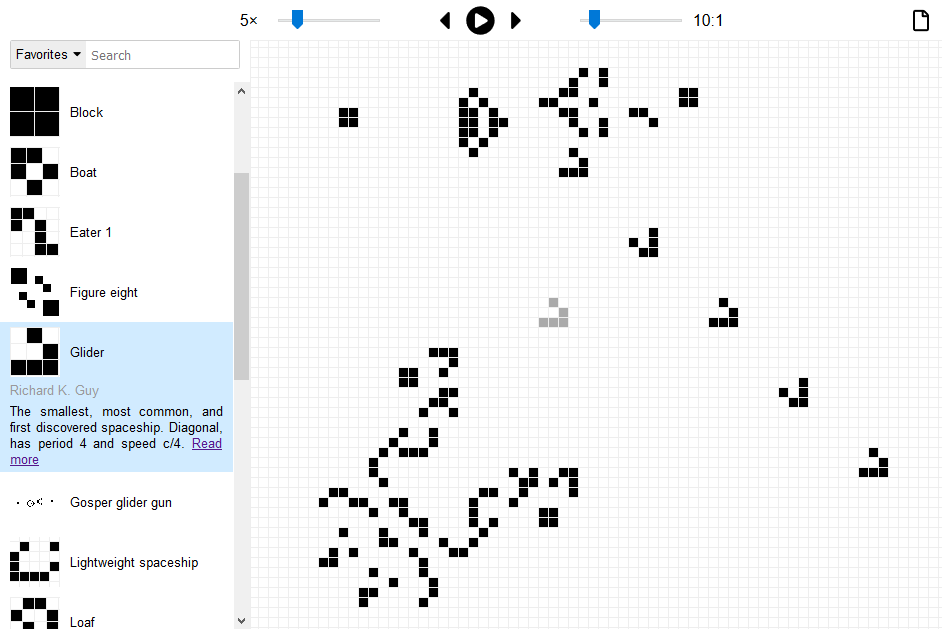

# Game of Life

This is a web app that plays
[Conway's Game of Life](https://en.wikipedia.org/wiki/Conway's_Game_of_Life).
You can edit single cells or place premade patterns from
[LifeWiki](http://conwaylife.com/wiki/Main_Page) on the board. The app has about
1,000 patterns that you can search for or filter by type (oscillator, spaceship,
etc.).

The app uses [React](https://reactjs.org/). You can build it using
[npm](https://www.npmjs.com/):

    npm install
    npm run build -- -p

To play, open the `dist/index.html` file in a web browser.
